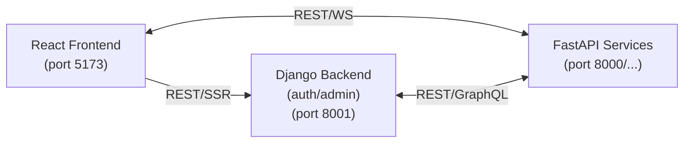

# Pyproject Template

[](https://nodejs.org/) | [](https://vitest.dev/) | [](https://www.python.org/) | [](https://docs.pytest.org/) | [](https://www.docker.com/) | [](https://github.com/grcote7/pyproject_template/pkgs/container/pyproject_template-backend) | [](https://github.com/grcote7/pyproject_template/actions/workflows/ci.yml) | [](https://github.com/grcote7/pyproject_template/actions/workflows/cd.yml) | [](z_doc/)

## Application web professionnelle

Basée sur :

* React (frontend)
* Django (core back‑office/auth)
* FastAPI (services critiques)

L’objectif est d’avoir une UI moderne et réactive, une base back‑office robuste (auth, admin, RBAC) et des services performants pour les besoins critiques.

Pour le dev, possibilité de démarrer 100% en local ou 100% en Docker. Dans les 2 cas, les hotreload + rafraichissement du navigateur (grâce à WS).

## Processes Démarrage

### Local

```css
./start
```

**💡 Note importante :** Si des services tournent déjà, `start.bat` vous proposera de les arrêter automatiquement.

Attention: La 1ère fois :

```css
./setup
```

### Arrêter les services

```css
./stop
```

Arrête proprement tous les services (FastAPI, Django, React).

À l'issue :

* [API](http://localhost:8000/docs)
* [BE](http://localhost:8001/admin) → Login: admin / admin
* [FE](http://localhost:5173)

**Note :** Un seul environnement virtuel à la racine (`.venv/`) contient toutes les dépendances Python (FastAPI + Django).

OU, 'à la main' :

1) BE - FastAPI

   * Créer un venv : python -m venv .venv
   * Activer : .venv\Scripts\activate
   * Installer :
     * python -m pip install --upgrade pip
     * pip install -r backend/requirements.txt
   * Lancer : uvicorn backend.app.main:app --reload --host 0.0.0.0 --port 8000

2) BE - Django

    Autre CLI :
    * Installer : pip install -r backend/django/requirements.txt
    * Migrations : python backend/django/manage.py migrate
    * Créer admin : python backend/django/manage.py shell -c "from django.contrib.auth import get_user_model; User = get_user_model(); User.objects.filter(username='admin').exists() or User.objects.create_superuser('admin', 'admin@localhost', 'admin')"
    * Lancer : python backend/django/manage.py runserver 0.0.0.0:8001

3) FE - React

    Autre CLI :
    cd frontend
    * Si 1ère fois
      Installer : npm i (dans frontend)
    * Lancer : npm run dev

### Docker

#### Lancer Docker-desktop + Containers

Note: Avoir fait fontionné l'App en mode local au préalable

Dans racine (Dev):

docker compose -f docker-compose.dev.yml up --build -d

OU (Prod):

docker compose -f docker-compose.prod.yml up --build -d

#### Déploiement VPS (prod)

Voir le guide complet : [z_doc/VPS-DEPLOY.md](z_doc/VPS-DEPLOY.md)

Pour avoir accès à l'admin (URL/admin) :

```bash
docker exec -it django_backend python manage.py createsuperuser
```

#### VPS multi‑domaines (Docker‑native)

Voir le guide : [z_doc/VPS-MULTI-DOMAIN.md](z_doc/VPS-MULTI-DOMAIN.md)

---

## Architecture

<!--
┌─────────────────┐         REST/WS          ┌──────────────────┐
│  React Frontend │◄────────────────────────►│ FastAPI Services │
│  (port 5173)    │                          │ (port 8000/...)  │
└─────────────────┘                          └──────────────────┘
     │                                                 ▲
     │ REST/SSR                                        │
     ▼                                                 │
┌─────────────────┐            REST/GraphQL            │
│ Django Backend  │◄───────────────────────────────────┘
│ (auth/admin)    │
│ (port 8001)     │
└─────────────────┘
-->



### Structures

#### FastAPI (services critiques)

```php
backend/
├── app/
│   ├── __init__.py
│   ├── main.py
│   ├── config.py          # Configuration centralisée
```

#### Django (core back‑office/auth)

```php
backend/
├── app/
│   ├── ...
├── django/
│   ├── manage.py
│   ├── config/                # settings, urls, wsgi/asgi
│   │   ├── __init__.py
│   │   ├── settings.py
│   │   ├── urls.py
│   │   ├── wsgi.py
│   │   └── asgi.py
│   ├── apps/
│   │   └── auth_api/          # auth/jwt
│   └── requirements.txt
```

#### React (frontend)

```php
frontend
├── public/                   # Assets statiques
├── src/
│   ├── main.jsx              # Point d'entrée
│   ├── App.jsx               # Composant racine
│   ├── index.css             # Styles globaux
│   ├── assets/               # Images, fonts
│   └── context/              # Context API
│       └── BackendContext.jsx
├── index.html
├── package.json
├── vite.config.js
├── tailwind.config.js
├── eslint.config.js
├── Dockerfile
└── Dockerfile.prod
```

---

## Configuration (.env)

**⚠️ IMPORTANT : Sécurité implémentée !**

Les fichiers `.env` sont maintenant requis pour configurer l'application de manière sécurisée.

### Première installation

```bash
# Windows
setup.bat

# Ou manuellement
cp .env.example .env
# Éditer .env avec vos valeurs
```

### Variables essentielles

```bash
# Environnement
ENV=dev                          # dev, staging, prod

# FastAPI
FASTAPI_PORT=8000
FASTAPI_CORS_ORIGINS=http://localhost:5173,http://localhost:3000

# Django
DJANGO_SECRET_KEY=votre-cle-secrete-50-caracteres-minimum
DJANGO_DEBUG=True                # False en production !
DJANGO_ALLOWED_HOSTS=localhost,127.0.0.1
DJANGO_CORS_ORIGINS=http://localhost:5173,http://localhost:3000

# Frontend
VITE_BACKEND_URL=http://localhost:8000
VITE_DJANGO_URL=http://localhost:8001
```

### Générer une SECRET_KEY sécurisée

```bash
python -c "from django.core.management.utils import get_random_secret_key; print(get_random_secret_key())"
```

**📖 Consultez [SECURITY.md](z_doc/SECURITY.md) pour le guide complet de sécurité**

---

## Tests automatisés

### Health Checks

Le script [start.bat](start.bat) exécute automatiquement des **health checks** après le démarrage des services :

* ✅ Vérifie que FastAPI répond (port 8000)
* ✅ Vérifie que Django répond (port 8001)
* ✅ Vérifie que React/Vite répond (port 5173)
* ⚡ Temps d'exécution : ~2-3 secondes
* 🚨 Affiche un **BIG message d'alerte** si un service ne répond pas

**Tester manuellement :**

```bash
# Health checks uniquement
test-health.bat

# Ou directement :
python tests/test_health.py
```

### Hot-Reload Tests

Teste que les modifications de code sont détectées et appliquées :

* 🔥 FastAPI (détecte les redémarrages via server_id)
* 🔥 Django (runserver --reload)
* 🔥 React/Vite (HMR - Hot Module Replacement)

**Tester manuellement :**

```bash
# Tests de hot-reload
test-hotreload.bat

# Ou directement :
python tests/test_hotreload.py
```

**📖 Consultez [tests/README.md](tests/README.md) pour plus de détails**

---

## Roadmap (BP - Battle Plan - Fil directeur unique)

1) ✅ **Sécurité & configuration (.env, CORS, secrets)**
    * Fichiers .env pour tous les services
    * CORS configuré (FastAPI + Django)
    * Secrets externalisés
    * Configuration par environnement
    * Voir [SECURITY.md](z_doc/SECURITY.md)

2) ✅ **Tests automatisés de santé**
    * Health checks des 3 serveurs
    * Tests de hot-reload
    * Intégration dans start.bat
    * Scripts dédiés (test-health.bat, test-hotreload.bat)

3) ✅ **Reverse proxy + routing** (Vite proxy en dev, Nginx en prod)

4) ✅ **Authentification JWT** (login/refresh + middleware) / ✅ **RBAC (base)**

5) ✅ **Rate limiting & protection anti‑abus** (quotas, IP throttling)

6) ✅ **Structure FastAPI modulaire** (routers/services/etc.)

7) ✅ **Gestion d’erreurs frontend globale (base)** (fetch + feedback utilisateur)

8) ✅ **Tests unitaires/E2E** (pytest, Vitest, Playwright)

9) ✅ **CI/CD** (lint, tests, build, push image, déploiement) → voir [z_doc/CI-CD.md](z_doc/CI-CD.md)

10) ❌ **Logging structuré + metrics**

11) ❌ **Documentation API enrichie** (descriptions, exemples, schémas WS)

12) ❌ **Base de données** (PostgreSQL/Redis) : persistance, sessions, cache

13) Serveur d'emails
    ❌ rDNS PTR cohérent (sg1.cote7.com)
    ❌ A/AAAA + SPF + DKIM + DMARC
    ❌ TLS (certificat valide), HELO correct
    ❌ Surveillance des bounces/blacklists
    ❌ Ouverture du port 25 (certains hébergeurs le bloquent)
    ❌ Postfix
    ❌ OpenDKIM
    ❌ DMARC

14) ❌ **Observabilité** (traces, dashboards)

15) ❌ **Versioning API + doc enrichie**

16) ❌ **Performance frontend**
    * Code splitting (lazy loading des composants)
    * Mise en cache des requêtes
    * Debounce sur les événements fréquents
    * Service Worker pour le mode offline
    * Possibilité d'évoluer vers le multilangues (front uniquement)

17) ❌ **Authentification avancée**
    * Sessions utilisateurs
    * OAuth2 (Google, GitHub)
    * CF. [Contrôle de Sécu](https://github.com/protectai/vulnhuntr)

18) ❌ Vérifications & contrôles global
    * Vérifier la récupération d’IP réelle derrière proxy (rate limiting par IP)

---

## Notes

* Le frontend appelle les APIs via le proxy.
* Le backend ne sert pas le frontend directement.
* Les responsabilités sont découplées pour scaler proprement.
* Les endpoints FastAPI sont disponibles en **/api** (legacy) et en **/api/v1** (versionné).
* APIs rapides et scalables
