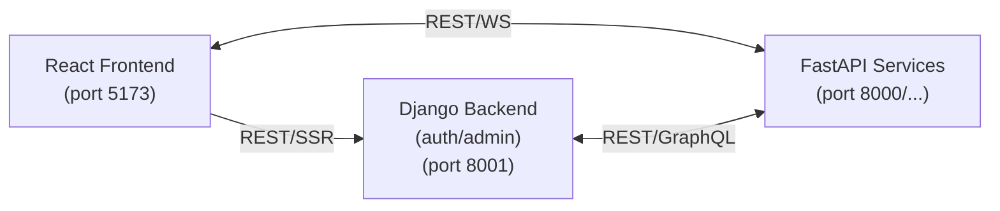

# Pyproject Template

## Objet : Application web professionnelle

Basée sur :

* React (frontend)
* Django (core back‑office/auth)
* FastAPI (services critiques)

L’objectif est d’avoir une UI moderne et réactive, une base back‑office robuste (auth, admin, RBAC) et des services performants pour les besoins critiques.

Pour le dev, possibilité de démarrer 100% en local ou 100% en Docker. Dans les 2 cas, les hotreload + rafraichissement du navigateur (grâce à WS).

## Technos

### Backends (API & Admin) & Bases de données


[](https://www.python.org)
[](https://pypi.org/project/fastapi/)


---

### Frontend

[](https://nodejs.org/)
[](https://www.npmjs.com/package/react)


---

---

### Outils DevOps & Tests


[](https://vitest.dev/)

---

### Conteneurisation Docker & CI/CD (/GH)

[](https://www.docker.com)
[](https://github.com/grcote7/pyproject_template/pkgs/container/pyproject_template-backend)
[](https://github.com/grcote7/pyproject_template/actions/workflows/ci.yml)
[](https://github.com/grcote7/pyproject_template/actions/workflows/cd.yml)

---

---

### Documentation & Release

[](z_doc/)
[](https://github.com/GrCOTE7/pyproject_template)

## Sommaire *(Table Of Content)*

<!-- TOC -->

- [Pyproject Template](#pyproject-template)
  - [Objet : Application web professionnelle](#objet--application-web-professionnelle)
  - [Technos](#technos)
    - [Backends (API \& Admin) \& Bases de données](#backends-api--admin--bases-de-données)
    - [Frontend](#frontend)
    - [Outils DevOps \& Tests](#outils-devops--tests)
    - [Conteneurisation Docker \& CI/CD (/GH)](#conteneurisation-docker--cicd-gh)
    - [Documentation \& Release](#documentation--release)
  - [Sommaire *(Table Of Content)*](#sommaire-table-of-content)
  - [Processes Démarrage](#processes-démarrage)
    - [Local](#local)
    - [Arrêter les services](#arrêter-les-services)
    - [Docker](#docker)
      - [Lancer Docker-desktop + Containers](#lancer-docker-desktop--containers)
      - [Déploiement VPS (prod)](#déploiement-vps-prod)
      - [VPS multi‑domaines (Docker‑native)](#vps-multidomaines-dockernative)
  - [Architecture](#architecture)
    - [Structures](#structures)
      - [FastAPI (services critiques)](#fastapi-services-critiques)
      - [Django (core back‑office/auth)](#django-core-backofficeauth)
      - [React (frontend)](#react-frontend)
  - [Configuration (.env)](#configuration-env)
    - [Première installation](#première-installation)
    - [Variables essentielles](#variables-essentielles)
    - [Générer une SECRET\_KEY sécurisée](#générer-une-secret_key-sécurisée)
  - [Tests automatisés](#tests-automatisés)
    - [Health Checks](#health-checks)
    - [Hot-Reload Tests](#hot-reload-tests)
  - [Roadmap (BP - Battle Plan - Fil directeur unique)](#roadmap-bp---battle-plan---fil-directeur-unique)
  - [Notes](#notes)

<!-- /TOC -->
<!-- /TOC -->

## Processes Démarrage

### Local

```css
./start
```

**💡 Note importante :** Si des services tournent déjà, `start.bat` les arrête automatiquement.

Attention: La 1ère fois :

```css
./setup
```

### Arrêter les services

```css
./stop
```

Arrête proprement tous les services (FastAPI, Django, React).

À l'issue :

* [API](http://localhost:8000/docs)
* [BE](http://localhost:8001/admin) → Login: admin / admin
* [FE PPT](http://localhost:5173)
* Option (Parfois non installé en local, car commenté dans les starters) [FE CGC](http://localhost:5174)

**Note :** Un seul environnement virtuel à la racine (`.venv/`) contient toutes les dépendances Python (FastAPI + Django).

OU, 'à la main' :

1) BE - FastAPI

   * Créer un venv : python -m venv .venv
   * Activer : .venv\Scripts\activate
   * Installer :
     * python -m pip install --upgrade pip
     * pip install -r backend/requirements.txt
   * Lancer : uvicorn backend.app.main:app --reload --host 0.0.0.0 --port 8000

2) BE - Django

    Autre CLI :
    * Installer : pip install -r backend/django/requirements.txt
    * Migrations : python backend/django/manage.py migrate
    * Créer admin : python backend/django/manage.py shell -c "from django.contrib.auth import get_user_model; User = get_user_model(); User.objects.filter(username='admin').exists() or User.objects.create_superuser('admin', 'admin@localhost', 'admin')"
    * Lancer : python backend/django/manage.py runserver 0.0.0.0:8001

3) FE - React

    Autre CLI :
    cd frontend
    * Si 1ère fois
      Installer : npm i (dans frontend)
    * Lancer : npm run dev

### Docker

#### Lancer Docker-desktop + Containers

Note: Avoir fait fonctionné l'App en mode local au préalable

Dans racine (Dev):

docker compose -f docker-compose.dev.yml up --build -d

OU (Prod):

docker compose -f docker-compose.prod.yml up --build -d

Note rapide : `docker.bat`

Vous pouvez utiliser le script `docker.bat` fourni pour démarrer les conteneurs sans taper la commande `docker compose` à la main.

* `./docker dev` → utilise `docker-compose.dev.yml`
* `./docker prod` → utilise `docker-compose.prod.yml`
* `./docker .` ou `./docker` (aucun argument) → utilise `docker-compose.yml` (fichier par défaut)

Exemples :

```powershell
./docker dev       # démarre l'environnement de dev (frontend, fastapi, django...)
./docker prod  # démarre l'environnement de production (selon docker-compose.prod.yml)
./docker       # force l'utilisation de docker-compose.yml (utile pour services comme redis/celery)
```

Remarque : le comportement par défaut peut être ajusté dans `docker.bat` (ligne de configuration `SUFFIX`).

#### Déploiement VPS (prod)

Voir le guide complet : [z_doc/VPS-DEPLOY.md](z_doc/VPS-DEPLOY.md)

Pour avoir accès à l'admin (URL/admin) :

```bash
docker exec -it django_backend python manage.py createsuperuser
```

#### VPS multi‑domaines (Docker‑native)

Voir le guide : [z_doc/VPS-MULTI-DOMAIN.md](z_doc/VPS-MULTI-DOMAIN.md)

---

## Architecture

<!--
┌─────────────────┐         REST/WS          ┌──────────────────┐
│  React Frontend │◄────────────────────────►│ FastAPI Services │
│  (port 5173)    │                          │ (port 8000/...)  │
└─────────────────┘                          └──────────────────┘
     │                                                 ▲
     │ REST/SSR                                        │
     ▼                                                 │
┌─────────────────┐            REST/GraphQL            │
│ Django Backend  │◄───────────────────────────────────┘
│ (auth/admin)    │
│ (port 8001)     │
└─────────────────┘
-->


```mermaid
flowchart LR
    FE["React Frontend<br/>(port 5173)"] <-->|REST/WS| FA["FastAPI Services<br/>(port 8000/...)"]
    FE -- REST/SSR --> DJ["Django Backend<br/>(auth/admin)<br/>(port 8001)"]
    DJ <-->|REST/GraphQL| FA
```

### Structures

#### FastAPI (services critiques)

```php
backend/
├── app/
│   ├── __init__.py
│   ├── main.py
│   ├── config.py          # Configuration centralisée
```

#### Django (core back‑office/auth)

```php
backend/
├── app/
│   ├── ...
├── django/
│   ├── manage.py
│   ├── config/                # settings, urls, wsgi/asgi
│   │   ├── __init__.py
│   │   ├── settings.py
│   │   ├── urls.py
│   │   ├── wsgi.py
│   │   └── asgi.py
│   ├── apps/
│   │   └── auth_api/          # auth/jwt
│   └── requirements.txt
```

#### React (frontend)

```php
frontend
├── public/                   # Assets statiques
├── src/
│   ├── main.jsx              # Point d'entrée
│   ├── App.jsx               # Composant racine
│   ├── index.css             # Styles globaux
│   ├── assets/               # Images, fonts
│   └── context/              # Context API
│       └── BackendContext.jsx
├── index.html
├── package.json
├── vite.config.js
├── tailwind.config.js
├── eslint.config.js
├── Dockerfile
└── Dockerfile.prod
```

---

## Configuration (.env)

**⚠️ IMPORTANT : Sécurité implémentée !**

Les fichiers `.env` sont maintenant requis pour configurer l'application de manière sécurisée.

### Première installation

```bash
# Windows
setup.bat

# Ou manuellement
cp .env.example .env
# Éditer .env avec vos valeurs

# Tip:
# Simple server local :
py -m http.server
# → http://localhost:8000/
```

### Variables essentielles

```bash
# Environnement
ENV=dev                          # dev, staging, prod

# FastAPI
FASTAPI_PORT=8000
FASTAPI_CORS_ORIGINS=http://localhost:5173,http://localhost:3000

# Django
DJANGO_SECRET_KEY=votre-cle-secrete-50-caracteres-minimum
DJANGO_DEBUG=True                # False en production !
DJANGO_ALLOWED_HOSTS=localhost,127.0.0.1
DJANGO_CORS_ORIGINS=http://localhost:5173,http://localhost:3000

# Frontend
VITE_BACKEND_URL=http://localhost:8000
VITE_DJANGO_URL=http://localhost:8001
```

### Générer une SECRET_KEY sécurisée

```bash
python -c "from django.core.management.utils import get_random_secret_key; print(get_random_secret_key())"
```

**📖 Consultez [SECURITY.md](z_doc/SECURITY.md) pour le guide complet de sécurité**

---

## Tests automatisés

### Health Checks

Le script [start.bat](start.bat) exécute automatiquement des **health checks** après le démarrage des services :

* ✅ Vérifie que FastAPI répond (port 8000)
* ✅ Vérifie que Django répond (port 8001)
* ✅ Vérifie que React/Vite répond (port 5173)
* ⚡ Temps d'exécution : ~2-3 secondes
* 🚨 Affiche un **BIG message d'alerte** si un service ne répond pas

**Tester manuellement :**

```bash
# Health checks uniquement
test-health.bat

# Ou directement :
python tests/test_health.py
```

### Hot-Reload Tests

Teste que les modifications de code sont détectées et appliquées :

* 🔥 FastAPI (détecte les redémarrages via server_id)
* 🔥 Django (runserver --reload)
* 🔥 React/Vite (HMR - Hot Module Replacement)

**Tester manuellement :**

```bash
# Tests de hot-reload
test-hotreload.bat

# Ou directement :
python tests/test_hotreload.py
```

**📖 Consultez [tests/README.md](tests/README.md) pour plus de détails**

---

## Roadmap (BP - Battle Plan - Fil directeur unique)

(Chronologique et graduel)

1) ✅ **Sécurité & configuration (.env, CORS, secrets)**
    * Fichiers .env pour tous les services
    * CORS configuré (FastAPI + Django)
    * Secrets externalisés
    * Configuration par environnement
    * Voir [SECURITY.md](z_doc/SECURITY.md)

2) ✅ **Tests automatisés de santé**
    * Health checks des 3 serveurs
    * Tests de hot-reload
    * Intégration dans start.bat
    * Scripts dédiés (test-health.bat, test-hotreload.bat)

3) ✅ **Reverse proxy + routing** (Vite proxy en dev, Nginx en prod)

4) ✅ **Authentification JWT** (login/refresh + middleware) / ✅ **RBAC (base)**

5) ✅ **Rate limiting & protection anti‑abus** (quotas, IP throttling)

6) ✅ **Structure FastAPI modulaire** (routers/services/etc.)

7) ✅ **Gestion d’erreurs frontend globale (base)** (fetch + feedback utilisateur)

8) ✅ **Tests unitaires/E2E** (pytest, Vitest, Playwright)

9) ✅ **CI/CD** (lint, tests, build, push image, déploiement) → voir [z_doc/CI-CD.md](z_doc/CI-CD.md)

10) Serveur d'emails

    * Send a simple email test :
        * Local
        * Dev
        * Prod

    * Config en + en prod :

        ❌ rDNS PTR cohérent (sg1.cote7.com)

        ❌ A/AAAA + SPF + DKIM + DMARC

        ❌ TLS (certificat valide), HELO correct

        ❌ Surveillance des bounces/blacklists

        ❌ Ouverture du port 25 (certains hébergeurs le bloquent)

        ❌ Postfix

        ❌ OpenDKIM

        ❌ DMARC

    * ❌ Créer unit test // emailing (local, dev et prod)

11) ❌ **Base de données** (PostgreSQL/Redis) : persistance, sessions, cache

12) ❌ **Celery**

13) ❌ **Redis**

14) ❌ **Logging structuré + metrics**

15) ❌ **Observabilité** (traces, dashboards)
    ❌ Page web monitorings

16) ❌ **Documentation API enrichie** (descriptions, exemples, schémas WS)

17) ❌ **Versioning API + doc enrichie**

18) ❌ **Performance frontend**

    * Code splitting (lazy loading des composants)
    * Mise en cache des requêtes
    * Debounce sur les événements fréquents
    * Service Worker pour le mode offline
    * Possibilité d'évoluer vers le multilangues (front uniquement)

19) ❌ **Authentification avancée**

    * Sessions utilisateurs
    * OAuth2 (Google, GitHub)
    * CF. [Contrôle de Sécu](https://github.com/protectai/vulnhuntr)

20) Vérifications globales & diverses

   ❌  Vérifier la récupération d’IP réelle derrière proxy (rate limiting par IP)

   ❌ Écrire page z_docs/VSC_Tips ou dans PyMox ? (Extension ToDo, avec settings pour comptage et coloration + raccourcis utiles -❌ ✅ ☢️ 🎯 ↗️ )

   ❌ Page Web /teck monitoring : Finir page monitoring (À prori utilisable qu'en local, et affichant les miniatures des 4 URLs clés, observant juste à l'appel, de la réponse HTTP par API...)

   ❌ Tests auto des emails: En attendant

```bash
./tests/test-email.py
Invoke-WebRequest -Uri "http://localhost:8000/api/test-email?to=test@local.test" -Method POST
Et/Ou Insomnia
```bash

   ❌ Intégrer auto-changelog & auto versions by commi_ts (Projet PyMox / GH)

   ❌ Adopter makefile pour gérer scripts starter, workflows (Test & CI/CD), etc...

   ❌ Protect branche main → fails tests => no P.R.

---

## Notes

* Le frontend appelle les APIs via le proxy.
* Le backend ne sert pas le frontend directement.
* Les responsabilités sont découplées pour scaler proprement.
* Les endpoints FastAPI sont disponibles en **/api** (legacy) et en **/api/v1** (versionné).
* APIs rapides et scalables

//2fix ? 2 tasks P
