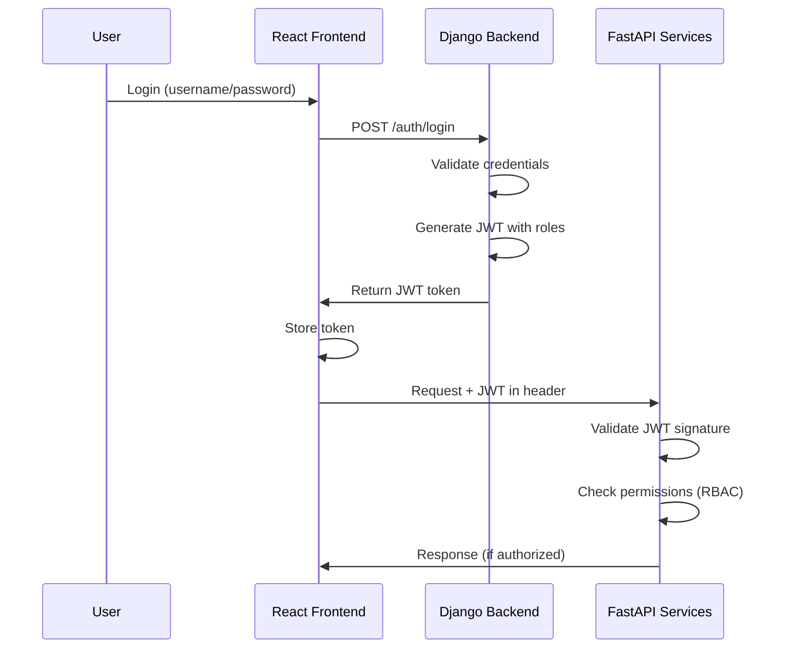

# Authentification JWT + RBAC

## Définitions des acronymes

### JWT

**JSON Web Token** est un standard ouvert (RFC 7519) qui définit une manière compacte et autonome de transmettre de façon sécurisée des informations entre deux parties sous forme d'objet JSON. Ces informations peuvent être vérifiées et fiables car elles sont signées numériquement.

### RBAC

**Role-Based Access Control** (Contrôle d'accès basé sur les rôles) est une approche de gestion des permissions où les droits d'accès sont attribués aux utilisateurs en fonction de leurs rôles dans l'organisation, plutôt qu'individuellement à chaque utilisateur.

---

## Introduction

JWT et RBAC sont **deux concepts complémentaires mais indépendants** qui peuvent être utilisés ensemble ou séparément selon les besoins de votre application.

---

## JWT seul (Authentification)

Vous pouvez avoir JWT **sans** RBAC :

- JWT identifie **qui** est l'utilisateur
- Tous les utilisateurs authentifiés ont les mêmes droits
- Utile pour des apps simples où tout le monde peut tout faire

**Exemple** : Blog personnel où seul le propriétaire se connecte

---

## RBAC seul (Autorisation)

Vous pouvez avoir RBAC **sans** JWT :

- Utiliser des sessions traditionnelles (cookies)
- Ou d'autres mécanismes d'auth (OAuth, SAML)
- RBAC gère juste **ce que** l'utilisateur peut faire

**Exemple** : App avec sessions Django classiques + rôles

---

## JWT + RBAC ensemble (Recommandé)

Dans une architecture moderne (comme la vôtre), les combiner apporte :

### JWT → "Qui es-tu ?" (Authentification)

- Token stateless
- Scalable pour microservices
- FastAPI peut valider sans appeler Django

### RBAC → "Que peux-tu faire ?" (Autorisation)

- Rôles encodés **dans le JWT**
- Permissions vérifiées à chaque requête
- Contrôle granulaire

### Exemple de JWT avec RBAC

```json
{
  "user_id": 123,
  "username": "alice",
  "role": "manager",
  "permissions": ["read", "update"],
  "exp": 1737500000
}
```

---

## Pour votre projet

Vu votre architecture (React + FastAPI + Django), **JWT + RBAC** est le plus adapté :

1. **Django** génère les JWT avec les rôles
2. **FastAPI** valide les JWT et vérifie les permissions
3. **React** adapte l'UI selon le rôle

### Flux d'authentification recommandé



### Avantages pour votre architecture

- ✅ **Stateless** : Pas de sessions à partager entre services
- ✅ **Scalable** : Chaque service valide le token indépendamment
- ✅ **Sécurisé** : Signature cryptographique du token
- ✅ **Flexible** : Granularité fine des permissions
- ✅ **Moderne** : Standard de l'industrie pour les microservices

---

## Roadmap d'implémentation (JWT + RBAC)

Pour votre projet **React + FastAPI + Django**, voici les **3 étapes de mise en place progressive** pour implémenter JWT + RBAC sans tout faire d'un coup :

### Phase 1 : JWT basique (Foundation)

**Objectif** : Mettre en place l'infrastructure d'authentification JWT (login + refresh + validation côté FastAPI + intégration front).

#### Backend Django - Authentification JWT

- ✅ Modèle User Django
- ✅ Endpoint `/auth/login` qui génère un JWT
- ✅ Endpoint `/auth/refresh` pour renouveler le token
- ✅ JWT contient : `user_id`, `username`, `exp`

#### Backend FastAPI - Validation des tokens

- ✅ Middleware de validation JWT
- ✅ Extraction du `user_id` depuis le token
- ✅ Tous les endpoints authentifiés (pas encore de distinction de rôles)

#### Frontend React - Interface de connexion

- ✅ Page de login
- ✅ Stockage du token (localStorage/cookies)
- ✅ Envoi du token dans les headers (`Authorization: Bearer`)
- ✅ Gestion du refresh automatique

**Livrable** : Application avec login fonctionnel, mais tous les utilisateurs ont les mêmes droits.

---

### Phase 2 : Ajout RBAC (Core Business Logic)

**Objectif** : //2do Différencier les utilisateurs par rôles

#### Backend Django - Gestion des rôles

- ✅ //2do Ajout du champ `role` au modèle User (Admin/Manager/User)
- ✅ //2do Modification du JWT pour inclure `role` et `permissions`
- ✅ //2do Endpoints d'administration des rôles (optionnel)

#### Backend FastAPI - Contrôle d'accès par rôle

- ✅ //2do Décorateurs de vérification de rôles (`@require_role("admin")`)
- ✅ //2do Protection des endpoints critiques par rôle
- ✅ //2do Messages d'erreur 403 Forbidden si rôle insuffisant

#### Frontend React - Affichage selon les rôles

- ✅ //2do Affichage conditionnel selon le rôle (menus, boutons)
- ✅ //2do Routes protégées par rôle
- ✅ //2do Gestion des erreurs 403

**Livrable** : //2do Application avec 3 niveaux d'accès fonctionnels (Admin > Manager > User).

---

### Phase 3 : RBAC avancé (Polish & Scale)

**Objectif** : //2do Affiner la sécurité et préparer l'évolution

#### Backend Django - Permissions granulaires

- ✅ //2do Permissions granulaires par ressource (ex: `can_edit_invoice`)
- ✅ //2do Configuration dynamique des rôles en base de données
- ✅ //2do Logs d'audit des accès sensibles
- ✅ //2do Révocation de tokens (blacklist)

#### Backend FastAPI - Contrôle d'accès avancé

- ✅ //2do Décorateurs de permissions fines (`@require_permission("edit_invoice")`)
- ✅ //2do Vérification par ressource (ex: user peut éditer SEULEMENT ses propres ressources)
- ✅ R//2do ate limiting par rôle

#### Frontend React - Administration des permissions

- ✅ //2do UI d'administration des rôles/permissions
- ✅ //2do Affichage des logs d'accès
- ✅ //2do Notifications de révocation de token

**Livrable** : //2do Système de permissions complet, auditable et évolutif.

---

### Recommandation

**Pour votre projet actuel :**

1. //2do Commencez par **Phase 1** (1-2 jours) pour valider l'architecture
2. //2do Passez rapidement à **Phase 2** (2-3 jours) car c'est le cœur de vos besoins
3. //2do **Phase 3** Permissions granulaires

💡 **L'avantage de cette approche** : Application fonctionnelle à chaque étape, tout en construisant progressivement un système robuste.
