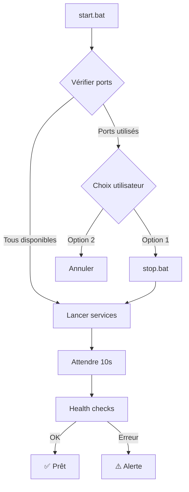

# 🔄 Gestion des Services - Guide Complet

## Problème résolu

**AVANT** : Lancer `start.bat` plusieurs fois créait plusieurs instances des services (3 consoles × N fois)

**MAINTENANT** : `start.bat` détecte les services actifs et propose de les arrêter proprement

---

## Scripts disponibles

### 1. `./start.bat` - Démarrage intelligent

Lance les 3 services avec vérification préalable des ports :

```bash
./start.bat
```

**Comportement** :

1. Vérifie si les ports 8000, 8001, 5173 sont utilisés
2. Si des services tournent déjà :
   - Propose d'arrêter et redémarrer
   - Ou d'annuler (garder les services actuels)
3. Lance les 3 services
4. Exécute les health checks automatiques

**Sortie exemple (ports déjà utilisés)** :

```
============================================================
🔍 Vérification des ports
============================================================

❌ Port 8000 (FastAPI) : UTILISÉ
❌ Port 8001 (Django) : UTILISÉ
❌ Port 5173 (React (Vite)) : UTILISÉ

============================================================
⚠️  ATTENTION : Des services semblent déjà en cours d'exécution
============================================================

===================================================

  ⚠️  ATTENTION : Des services semblent déjà actifs

  Que souhaitez-vous faire ?
  1. Arrêter les services existants et redémarrer
  2. Annuler (laisser les services actuels)

===================================================

Votre choix (1 ou 2) :
```

### 2. `./stop.bat` - Arrêt propre

Arrête tous les services en cours :

```bash
./stop.bat
```

**Action** :
- Tue les processus sur les ports 8000, 8001, 5173
- Nettoie proprement toutes les instances

### 3. `tests/check_ports.py` - Vérification manuelle

Vérifie quels ports sont utilisés :

```bash
python tests/check_ports.py
```

**Sortie exemple** :

```
============================================================
🔍 Vérification des ports
============================================================

✅ Port 8000 (FastAPI) : DISPONIBLE
✅ Port 8001 (Django) : DISPONIBLE
✅ Port 5173 (React (Vite)) : DISPONIBLE

============================================================
✅ Tous les ports sont disponibles
============================================================
```

---

## Workflows typiques

### Premier lancement de la journée

```bash
./start.bat
```

→ Aucun service actif, démarre directement

### Relancer après des modifications

```bash
./start.bat
# → Détecte les services actifs
# → Choix 1 : Arrêter et redémarrer
```

### Arrêter en fin de journée

```bash
./stop.bat
```

### Vérifier l'état des services

```bash
python tests/check_ports.py
```

---

## Architecture technique

### Détection des ports (check_ports.py)

Utilise `socket.bind()` pour tester si un port est disponible :

```python
def is_port_in_use(port: int) -> bool:
    with socket.socket(socket.AF_INET, socket.SOCK_STREAM) as s:
        try:
            s.bind(("127.0.0.1", port))
            return False  # Port disponible
        except OSError:
            return True   # Port utilisé
```

### Arrêt des processus (stop.bat)

Utilise `netstat` + `taskkill` pour identifier et arrêter les processus :

```batch
for /f "tokens=5" %%a in ('netstat -aon ^| find ":8000" ^| find "LISTENING"') do taskkill /F /PID %%a
```

### Flux de start.bat



---

## Codes de sortie

### check_ports.py

- `0` : Tous les ports sont disponibles
- `1` : Au moins un port est utilisé

### start.bat

- Utilise le code de sortie de `check_ports.py` pour décider du comportement

---

## En cas de problème

### Les services ne s'arrêtent pas

```bash
# Forcer l'arrêt manuel via gestionnaire de tâches
# Ou via PowerShell :
Get-Process | Where-Object {$_.Path -like "*uvicorn*"} | Stop-Process -Force
Get-Process | Where-Object {$_.Path -like "*python*"} | Stop-Process -Force
Get-Process | Where-Object {$_.CommandLine -like "*npm*"} | Stop-Process -Force
```

### Les ports restent "utilisés" alors que rien ne tourne

Attendre 1-2 minutes (le système d'exploitation peut garder les ports en `TIME_WAIT`), puis :

```bash
./stop.bat
timeout /t 30
./start.bat
```

### Vérifier manuellement les processus sur un port

```bash
# PowerShell
netstat -ano | findstr :8000
```

---

## Améliorations futures possibles

- [ ] Script `restart.bat` (stop + start en une commande)
- [ ] Logs de démarrage/arrêt avec timestamps
- [ ] Détection des processus zombies
- [ ] Mode "force restart" sans confirmation

---

**Plus jamais de multiples instances qui tournent en parallèle ! 🎉**
